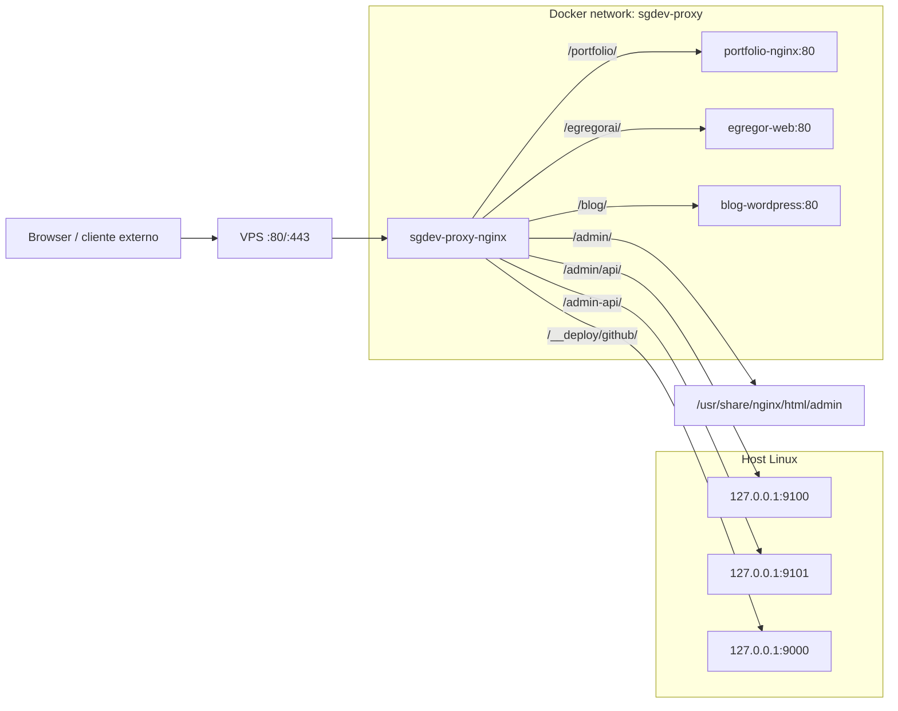

# Sgdev Infra

Infraestructura base para operar multiples aplicaciones Docker Compose en una
sola VPS, usando un Nginx compartido como gateway HTTP/HTTPS, una red Docker
externa comun y configuracion declarativa por proyecto.

Este repositorio no es solamente un conjunto de scripts: define una convencion
operativa para registrar, desplegar, enrutar, monitorear, respaldar y retirar
apps por `slug`.

## Objetivo tecnico

La plataforma resuelve este caso:

- una VPS publica con puertos `80/tcp` y `443/tcp`;
- Nginx como unico entrypoint publico;
- una red Docker externa compartida, `sgdev-proxy`;
- un repositorio Compose independiente por aplicacion;
- un archivo de configuracion por app en `/etc/sgdev-infra/apps/<slug>.env`;
- rutas publicas por path, por ejemplo `/portfolio/`, `/egregorai/` o `/blog/`;
- despliegues reproducibles por script y opcionalmente por GitHub Actions,
  Terraform o webhook firmado de GitHub;
- consola web estatica en `/admin` con APIs locales protegidas por token.

No intenta reemplazar Kubernetes, un PaaS gestionado, service mesh, balanceador
cloud ni una plataforma multi-tenant estricta. Esta orientado a demos, MVPs,
portfolio y laboratorios privados donde se busca control directo de la VPS.

## Invariantes de arquitectura

Estas reglas son la base del sistema:

- Solo el proxy central publica puertos hacia internet.
- Las apps no deben exponer `ports` publicos para servicios web, bases de datos,
  Redis ni servicios internos.
- Todo servicio web que deba recibir trafico publico debe estar conectado a la
  red externa Docker `sgdev-proxy`.
- Cada proyecto mantiene su propio Compose, `.env`, volumenes y ciclo de vida.
- El proxy no lee secretos de las apps; solo conoce `APP_PATH`, `APP_UPSTREAM` y
  parametros HTTP de Nginx.
- La configuracion runtime de apps vive fuera del repo, en `/etc/sgdev-infra`.
- Los backups generados viven fuera del repo, en `/opt/backups`.
- Los secretos, `terraform.tfvars`, `terraform.tfstate`, `.env` y claves SSH no
  deben versionarse.

## Topologia



## Layout de filesystem

Layout esperado en la VPS:

```text
/opt/
  sgdev-infra/                 # este repositorio
  apps/
    <slug>/
      repo/                    # repo real de la app
      backups/                 # opcional, si una app lo usa localmente
  backups/
    <slug>/                    # backups generados por scripts
  secrets/                     # secretos manuales fuera de Git

/etc/sgdev-infra/
  apps/
    <slug>.env                 # contrato declarativo de una app
  cicd/
    <slug>.env                 # contrato de webhook GitHub por app
  admin-api.env                # token y config del monitor read-only
  admin-control-api.env        # token y config del control API

/var/log/sgdev-infra/
  <slug>-deploy.log            # logs del webhook deploy
```

Dentro del repo:

```text
proxy/
  compose.yml                  # Nginx compartido
  nginx/
    nginx.conf
    conf.d/default.conf        # server block HTTP versionado
    conf.d/ssl.conf            # generado por install-https.sh, no versionado
    app-locations/<slug>.conf  # rutas renderizadas por app-render-nginx.sh
    templates/
      location.conf.template
      ssl.conf.template
  www/
    index.html
    admin/                     # consola estatica

scripts/
  lib.sh                       # constantes, loader de config y compose args
  install-host.sh              # bootstrap de paquetes, Docker, dirs y red
  proxy-up.sh                  # levanta Nginx compartido
  proxy-reload.sh              # nginx -t + reload dentro del contenedor
  install-https.sh             # certbot + server block TLS
  sync-ssl-conf.sh             # regenera ssl.conf desde la plantilla actual
  app-new.sh                   # registra app generica
  app-deploy.sh                # pull/build/up/render/reload por slug
  app-render-nginx.sh          # genera app-locations/<slug>.conf
  app-status.sh
  app-logs.sh
  app-stop.sh
  app-remove.sh
  app-backup.sh
  app-db-export-excel.sh
  app-db-import-excel.sh
  app-new-wordpress.sh
  install-cicd.sh
  install-admin-api.sh
```

## Componentes

### Proxy compartido

`proxy/compose.yml` levanta el servicio `nginx` con:

- imagen `nginx:1.27-alpine`;
- nombre de contenedor `sgdev-proxy-nginx`;
- `restart: unless-stopped`;
- publicacion de `${HTTP_PORT:-80}:80` y `${HTTPS_PORT:-443}:443`;
- montaje read-only de configuracion Nginx, ubicaciones de apps y contenido
  estatico;
- montaje read-only de `/etc/letsencrypt`;
- `extra_hosts: host.docker.internal:host-gateway` para llegar a servicios del
  host desde Nginx;
- healthcheck en `http://127.0.0.1/health`;
- red externa `${PROXY_NETWORK:-sgdev-proxy}`.

### Configuracion por app

Cada app se declara en:

```text
/etc/sgdev-infra/apps/<slug>.env
```

El loader comun esta en `scripts/lib.sh`. Los valores principales son:

| Variable | Requerida | Default | Uso |
| --- | --- | --- | --- |
| `APP_SLUG` | No | nombre del archivo | Identidad logica de la app. Debe coincidir con `<slug>`. |
| `APP_PATH` | No | `/<slug>` | Prefijo publico en Nginx. No puede ser `/`. |
| `APP_UPSTREAM` | Si | ninguno | URL interna visible desde Nginx, por ejemplo `http://portfolio-nginx:80`. |
| `APP_ROOT` | No | `/opt/apps/<slug>` | Raiz operativa de la app. |
| `REPO_DIR` | No | `/opt/apps/<slug>/repo` | Directorio donde vive el repo Compose de la app. |
| `COMPOSE_FILE` | No | `compose.yml` | Compose unico legacy. |
| `COMPOSE_FILES` | No | valor de `COMPOSE_FILE` | Lista de Compose files, separados por espacios. |
| `ENV_FILE` | No | `.env` | Archivo env pasado a `docker compose --env-file`. Puede ser relativo a `REPO_DIR`. |
| `BRANCH` | No | `main` | Rama usada por `app-deploy.sh`. |
| `GIT_REMOTE_URL` | No | vacio | Si el repo no existe, `app-deploy.sh` lo clona desde esta URL. |
| `STRIP_PREFIX` | No | `true` | Controla si Nginx elimina el prefijo antes de hacer proxy. |
| `CLIENT_MAX_BODY_SIZE` | No | `25m` | `client_max_body_size` del location generado. |
| `PROXY_CONNECT_TIMEOUT` | No | `10s` | Timeout de conexion upstream. |
| `PROXY_READ_TIMEOUT` | No | `120s` | Timeout de lectura upstream. |
| `PROXY_SEND_TIMEOUT` | No | `120s` | Timeout de escritura upstream. |
| `BACKUP_DIR` | No | `/opt/backups/<slug>` | Destino de backups. |

Ejemplo generico:

```bash
APP_SLUG=miapp
APP_PATH=/miapp
APP_UPSTREAM=http://miapp-web:80
APP_ROOT=/opt/apps/miapp
REPO_DIR=/opt/apps/miapp/repo
COMPOSE_FILES="compose.yml compose.proxy.yml"
ENV_FILE=.env
BRANCH=main
GIT_REMOTE_URL=https://github.com/owner/miapp.git
STRIP_PREFIX=true
CLIENT_MAX_BODY_SIZE=25m
PROXY_CONNECT_TIMEOUT=10s
PROXY_READ_TIMEOUT=120s
PROXY_SEND_TIMEOUT=120s
BACKUP_DIR=/opt/backups/miapp
```

### Contrato Docker Compose de una app

Un proyecto compatible debe cumplir:

- tener un `compose.yml` o archivos listados en `COMPOSE_FILES`;
- tener un servicio HTTP conectado a la red externa `sgdev-proxy`;
- exponer su puerto internamente con `expose`, no con `ports`;
- declarar un alias estable que coincida con el host usado en `APP_UPSTREAM`;
- aislar DB, Redis, workers y servicios privados en redes internas del proyecto;
- mantener secretos en el `.env` de la app, no en este repo.

Ejemplo minimo:

```yaml
services:
  web:
    image: nginx:1.27-alpine
    expose:
      - "80"
    networks:
      proxy:
        aliases:
          - miapp-web
      internal:

  db:
    image: postgres:16-alpine
    networks:
      - internal

networks:
  proxy:
    external: true
    name: sgdev-proxy
  internal:
    internal: true
```

### Render de Nginx

`scripts/app-render-nginx.sh <slug>`:

1. carga `/etc/sgdev-infra/apps/<slug>.env`;
2. valida `APP_SLUG`, `APP_PATH` y `APP_UPSTREAM`;
3. calcula `NGINX_PROXY_PASS`;
4. aplica `envsubst` sobre `proxy/nginx/templates/location.conf.template`;
5. escribe `proxy/nginx/app-locations/<slug>.conf`.

La plantilla genera:

- redirect `301` de `/slug` a `/slug/`;
- `location ^~ /slug/`;
- headers `X-Forwarded-*`;
- `X-Forwarded-Prefix`;
- soporte de upgrade HTTP para WebSocket;
- limites y timeouts configurables por app.

`STRIP_PREFIX` modifica el `proxy_pass` generado:

```text
STRIP_PREFIX=true   -> proxy_pass http://miapp-web:80/
STRIP_PREFIX=false  -> proxy_pass http://miapp-web:80
```

Con `true`, Nginx envia `/` al upstream cuando el cliente pide `/miapp/`.
Con `false`, la app recibe el path completo `/miapp/...`.

## Bootstrap de una VPS Ubuntu

Primer arranque:

```bash
sudo apt-get update
sudo apt-get install -y git
sudo git clone URL_DE_ESTE_REPO /opt/sgdev-infra
cd /opt/sgdev-infra
sudo chmod +x scripts/*.sh
sudo ./scripts/install-host.sh
./scripts/proxy-up.sh
```

`install-host.sh` instala o prepara:

- `ca-certificates`, `curl`, `git`, `gettext-base`, `python3`, `jq`,
  `util-linux`, `ufw`;
- Docker Engine y Compose plugin si Docker no existe;
- directorios `/opt/apps`, `/opt/backups`, `/opt/secrets`;
- directorios `/etc/sgdev-infra/apps` y `/etc/sgdev-infra/cicd`;
- red Docker externa `sgdev-proxy`;
- reglas UFW para OpenSSH, `80/tcp` y `443/tcp`;
- grupo `docker` para el usuario que ejecuto `sudo`, si aplica.

Si el usuario fue agregado al grupo `docker`, cerrar y abrir la sesion SSH antes
de operar Docker sin `sudo`.

## HTTPS

Activacion:

```bash
sudo ./scripts/install-https.sh sebasdeveloperlife@gmail.com sgdev.com.ar www.sgdev.com.ar
```

El script:

1. instala `certbot`;
2. levanta el proxy HTTP si hace falta;
3. usa challenge webroot en `proxy/www/.well-known/acme-challenge`;
4. emite o reutiliza el certificado Let's Encrypt;
5. renderiza `proxy/nginx/conf.d/ssl.conf` desde
   `proxy/nginx/templates/ssl.conf.template`;
6. recarga Nginx;
7. crea `/etc/cron.d/sgdev-certbot-renew`.

Importante: `ssl.conf` es un artefacto generado en la VPS. Si cambia la
plantilla TLS y los certificados ya existen, no hace falta pedir certificados
otra vez:

```bash
./scripts/sync-ssl-conf.sh
./scripts/proxy-reload.sh
```

## Registrar una app

Registro manual:

```bash
sudo mkdir -p /opt/apps/miapp
sudo git clone URL_DEL_REPO /opt/apps/miapp/repo
sudo ./scripts/app-new.sh miapp /opt/apps/miapp/repo http://miapp-web:80 /miapp compose.yml .env
sudo nano /etc/sgdev-infra/apps/miapp.env
./scripts/app-deploy.sh miapp
```

`app-new.sh` crea el archivo de config y renderiza la ruta Nginx inicial. No
valida que el Compose ya sea correcto; esa validacion ocurre durante deploy y
reload.

## Deploy

Comando:

```bash
./scripts/app-deploy.sh <slug>
./scripts/app-deploy.sh <slug> --no-pull
```

Flujo interno:

1. carga la config del slug;
2. exige `docker`, `git` y `flock`;
3. toma lock no bloqueante en `/tmp/sgdev-deploy-<slug>.lock`;
4. crea `APP_ROOT` y `BACKUP_DIR`;
5. si `REPO_DIR/.git` no existe y `GIT_REMOTE_URL` esta configurado, clona;
6. si no se pasa `--no-pull`, ejecuta `fetch`, `checkout` y `pull --ff-only`;
7. crea la red Docker `sgdev-proxy` si no existe;
8. arma los argumentos Compose desde `COMPOSE_FILES` y `ENV_FILE`;
9. ejecuta `docker compose up -d --build`;
10. si existe un servicio Compose llamado `nginx`, lo reinicia para refrescar
    resolucion DNS de upstreams;
11. renderiza el location Nginx;
12. recarga el proxy si esta corriendo o lo levanta si no lo esta.

El deploy es por app, no global. Cada slug tiene su propio lock.

## Operacion diaria

```bash
# estado del proxy y lista de apps registradas
./scripts/app-status.sh

# estado Compose y ruta de una app
./scripts/app-status.sh miapp

# logs de una app
./scripts/app-logs.sh miapp

# deploy normal
./scripts/app-deploy.sh miapp

# rebuild/restart sin git pull
./scripts/app-deploy.sh miapp --no-pull

# detener contenedores sin borrar volumenes
./scripts/app-stop.sh miapp

# quitar la ruta del proxy sin borrar repo, env ni volumenes
./scripts/app-remove.sh miapp

# quitar la ruta y detener la app
./scripts/app-remove.sh miapp --stop

# backup segun config BACKUP_*
./scripts/app-backup.sh miapp
```

## Backups

`app-backup.sh <slug>` soporta tres mecanismos declarados en el `.env` de app:

```bash
BACKUP_COMMAND='comando shell custom dentro de REPO_DIR'
BACKUP_VOLUMES="volumen_1 volumen_2"
BACKUP_PATHS="ruta_relativa_o_absoluta otra_ruta"
```

Comportamiento:

- `BACKUP_COMMAND` se ejecuta con `bash -lc` dentro de `REPO_DIR`;
- cada volumen en `BACKUP_VOLUMES` se empaqueta con un contenedor `alpine:3.20`;
- cada path en `BACKUP_PATHS` se empaqueta con `tar`;
- los archivos terminan en `BACKUP_DIR`;
- si no hay ningun mecanismo configurado, el script falla explicitamente.

## Export/import de DB a Excel

Para archivar datos por proyecto:

```bash
./scripts/app-db-export-excel.sh miapp
./scripts/app-db-import-excel.sh miapp /opt/backups/miapp/miapp-db-YYYYMMDDTHHMMSSZ.xlsx
```

Motores soportados:

- PostgreSQL mediante `psql`;
- MySQL/MariaDB mediante `mysql` o `mariadb`.

Variables relevantes:

```bash
APP_ID=miapp
DB_EXCEL_ENGINE=postgres        # postgres | mysql
DB_EXCEL_SERVICE=db
DB_EXCEL_DATABASE=app
DB_EXCEL_USER=app
DB_EXCEL_PASSWORD=
DB_EXCEL_TABLES="public.users public.orders"
DB_EXCEL_APP_ID_COLUMN=app_id
```

Si `APP_ID` existe y la tabla tiene la columna `DB_EXCEL_APP_ID_COLUMN`, el
export filtra filas del proyecto. Las tablas sin esa columna se exportan
completas.

Modos de importacion:

```bash
# inserta filas; puede fallar por primary keys duplicadas
./scripts/app-db-import-excel.sh miapp archivo.xlsx --mode insert

# borra filas del APP_ID en tablas filtrables y luego inserta
./scripts/app-db-import-excel.sh miapp archivo.xlsx --mode replace-project

# permite importar un workbook cuyo app_slug/app_id no coincide
./scripts/app-db-import-excel.sh miapp archivo.xlsx --allow-cross-app
```

El workbook incluye una hoja por tabla y una hoja oculta de manifiesto. La
generacion SQL la hace `scripts/app-db-excel.py`.

## Admin web y APIs locales

La consola estatica vive en:

```text
https://sgdev.com.ar/admin
```

Rutas Nginx:

| Ruta publica | Destino | Proposito |
| --- | --- | --- |
| `/admin` | redirect a `/admin/login/` | Entrada de la consola |
| `/admin/` | archivos en `proxy/www/admin` | SPA estatica |
| `/admin/api/` | `host.docker.internal:9100` | Monitor read-only legacy |
| `/admin-api/` | `host.docker.internal:9101` | Control API con acciones permitidas |

Instalacion:

```bash
cd /opt/sgdev-infra
git pull --ff-only
sudo chmod +x scripts/*.sh
sudo ./scripts/install-admin-api.sh
./scripts/sync-ssl-conf.sh
./scripts/proxy-reload.sh
sudo grep SGDEV_ADMIN_API_TOKEN /etc/sgdev-infra/admin-api.env
systemctl status sgdev-admin-api.service
systemctl status sgdev-admin-control-api.service
```

En Linux, el instalador intenta escuchar sobre la IP de `docker0`, por ejemplo
`172.17.0.1`, para que `sgdev-proxy-nginx` pueda llegar al host con
`host.docker.internal`. Si se necesita forzar otro bind:

```bash
sudo SGDEV_ADMIN_API_BIND_HOST=127.0.0.1 ./scripts/install-admin-api.sh
```

Si `https://sgdev.com.ar/admin/` carga pero el panel dice que el backend esta
apagado, validar primero la ruta HTTPS del control API:

```bash
curl -i https://sgdev.com.ar/admin-api/health
```

Si responde `404`, el servicio probablemente esta vivo pero `ssl.conf` quedo
generado con una plantilla vieja. En la VPS:

```bash
cd /opt/sgdev-infra
git pull --ff-only origin main
chmod +x scripts/*.sh
sudo ./scripts/install-admin-api.sh
./scripts/sync-ssl-conf.sh
./scripts/proxy-reload.sh
curl -i https://sgdev.com.ar/admin-api/health
```

### `sgdev-admin-api.service`

Servicio read-only:

- escucha en `SGDEV_ADMIN_API_HOST:9100`;
- ejecuta `admin/monitor_api.py`;
- token en `/etc/sgdev-infra/admin-api.env`;
- endpoint principal: `GET /v1/snapshot`;
- expone CPU, memoria, discos, procesos, red, Docker y apps registradas;
- no ejecuta acciones recibidas desde el navegador.

Prueba local en la VPS:

```bash
admin_host="$(grep '^SGDEV_ADMIN_API_HOST=' /etc/sgdev-infra/admin-api.env | cut -d= -f2-)"
curl -H "X-SGDEV-Admin-Token: TOKEN" "http://$admin_host:9100/v1/snapshot"
```

### `sgdev-admin-control-api.service`

Servicio de control:

- escucha en `SGDEV_ADMIN_API_HOST:9101`;
- ejecuta `admin_api.py`;
- token en `/etc/sgdev-infra/admin-control-api.env`;
- soporta modo `local` en la VPS y modo `ssh` para desarrollo local;
- expone estado, logs y una lista cerrada de acciones.

Endpoints:

```text
GET  /health
GET  /state
GET  /logs?slug=<slug>&service=<service>&tail=200
POST /actions
```

Acciones permitidas por `POST /actions`:

```json
{"action":"deploy","slug":"miapp"}
{"action":"deploy-local","slug":"miapp"}
{"action":"status","slug":"miapp"}
{"action":"backup","slug":"miapp"}
{"action":"stop","slug":"miapp"}
{"action":"remove","slug":"miapp"}
{"action":"remove-stop","slug":"miapp"}
```

Autenticacion:

```bash
admin_host="$(grep '^SGDEV_ADMIN_API_HOST=' /etc/sgdev-infra/admin-control-api.env | cut -d= -f2-)"
curl -H "Authorization: Bearer TOKEN" "http://$admin_host:9101/state"
curl -H "Authorization: Bearer TOKEN" \
  -H "Content-Type: application/json" \
  -d '{"action":"status","slug":"miapp"}' \
  "http://$admin_host:9101/actions"
```

## CI/CD

Hay cuatro caminos soportados:

1. Manual por SSH: `./scripts/app-deploy.sh <slug>`.
2. GitHub Actions manual: workflow `.github/workflows/deploy-app.yml`.
3. Terraform + GitHub Actions: workflow `.github/workflows/terraform.yml`.
4. Webhook GitHub entrante: `cicd/webhookd.py`.

### Workflow `Deploy app`

`workflow_dispatch` con inputs:

- `slug`: app registrada en `/etc/sgdev-infra/apps/<slug>.env`;
- `no_pull`: `"true"` o `"false"`.

Secrets esperados:

```text
SGDEV_SSH_PRIVATE_KEY
SGDEV_VPS_HOST
SGDEV_SSH_PORT
SGDEV_SSH_USER
```

El job entra por SSH, actualiza `/opt/sgdev-infra`, reinstala admin API si
corresponde, levanta/reload el proxy y ejecuta `app-deploy.sh`.

### Webhook GitHub

Instalacion:

```bash
sudo ./scripts/install-cicd.sh
```

Nginx publica el webhook bajo:

```text
/__deploy/github/<slug>
```

El daemon local escucha por default en `127.0.0.1:9000` y valida:

- `X-Hub-Signature-256` con HMAC SHA-256;
- archivo `/etc/sgdev-infra/cicd/<slug>.env`;
- evento `push`;
- repositorio esperado, si `GITHUB_REPOSITORY` esta configurado;
- rama esperada, `GITHUB_BRANCH` o `main`.

Ejemplo de config:

```bash
GITHUB_WEBHOOK_SECRET=valor_largo
GITHUB_REPOSITORY=owner/repo
GITHUB_BRANCH=main
DEPLOY_SCRIPT=/opt/sgdev-infra/scripts/app-deploy.sh
```

El deploy queda encolado en un thread y escribe logs en
`/var/log/sgdev-infra/<slug>-deploy.log`.

## Terraform

El modulo Terraform usa provider `null` y provisioners SSH para preparar la VPS.
No crea la VPS cloud: asume que ya existe y que se puede acceder por SSH.

Variables principales:

| Variable | Default | Descripcion |
| --- | --- | --- |
| `vps_host` | `143.95.217.87` | IP o DNS de la VPS. |
| `ssh_port` | `22022` | Puerto SSH. |
| `ssh_user` | `root` | Usuario SSH. |
| `ssh_private_key` | vacio | Clave privada. Preferida sobre password. |
| `vps_password` | vacio | Password fallback. |
| `domain` | `sgdev.com.ar` | Dominio publico primario. |
| `infra_repo_url` | repo SGDEV | URL Git de esta infra. |
| `infra_branch` | `main` | Rama de infra. |
| `install_path` | `/opt/sgdev-infra` | Path de instalacion. |
| `apps_root` | `/opt/apps` | Raiz de apps. |
| `backups_root` | `/opt/backups` | Raiz de backups. |
| `configure_portfolio` | `false` | Si escribe config y despliega portfolio. |

Comandos wrapper:

```powershell
.\scripts\terraform.ps1 plan -var-file=terraform.tfvars
.\scripts\terraform.ps1 apply -var-file=terraform.tfvars
```

```bash
./scripts/terraform.sh plan -var-file=terraform.tfvars
./scripts/terraform.sh apply -var-file=terraform.tfvars
```

El workflow de GitHub ejecuta `terraform fmt -check`, `init`, `validate`,
`plan` y solo aplica cuando se dispara manualmente con `action=apply` sobre
`main`.

## WordPress

Para crear un WordPress Docker administrado por esta infra:

```bash
sudo env WORDPRESS_SITE_TITLE="Blog SGDEV" \
  WORDPRESS_ADMIN_EMAIL="admin@sgdev.com.ar" \
  bash ./scripts/app-new-wordpress.sh blog sgdev.com.ar /blog

./scripts/app-deploy.sh blog --no-pull
```

Genera:

```text
/opt/apps/blog/repo/compose.yml
/opt/apps/blog/repo/.env
/opt/apps/blog/repo/wp-content
/etc/sgdev-infra/apps/blog.env
```

Caracteristicas:

- `wordpress:6.6-php8.3-apache`;
- `mariadb:11.4`;
- red externa `sgdev-proxy`;
- red interna para DB;
- volumenes `wordpress_data` y `mariadb_data`;
- `WP_HOME` y `WP_SITEURL` apuntando al path publico;
- backups de volumen configurados;
- DB Excel configurada para MySQL/MariaDB.

Con el router actual, `APP_PATH=/` no esta permitido. Para WordPress en la raiz
de un dominio dedicado conviene agregar routing por host/subdominio antes.

## Routing por path

Publicar apps bajo paths funciona si cada frontend soporta su base publica.

Vite:

```ts
export default defineConfig({
  base: '/miapp/',
})
```

Next.js:

```js
const nextConfig = {
  basePath: '/miapp',
}
module.exports = nextConfig
```

Problema frecuente: assets absolutos como `/assets/...` o `/_next/...` se piden
contra la raiz del dominio y pueden colisionar con otras apps. Si una app no
tolera path prefix, usar `STRIP_PREFIX=true` solo ayuda al backend, pero no
corrige URLs absolutas emitidas al navegador.

La evolucion natural para mas proyectos publicos es pasar a subdominios:

```text
https://portfolio.sgdev.com.ar
https://egregorai.sgdev.com.ar
https://blog.sgdev.com.ar
```

## Redirect raiz

La raiz publica redirige temporalmente a portfolio:

```nginx
location = / {
    return 302 /portfolio/;
}
```

La regla existe en:

```text
proxy/nginx/conf.d/default.conf
proxy/nginx/templates/ssl.conf.template
```

Si HTTPS ya esta activo, cambiar la plantilla no alcanza: hay que regenerar
`proxy/nginx/conf.d/ssl.conf` con `./scripts/sync-ssl-conf.sh` y luego
`./scripts/proxy-reload.sh`.

## Seguridad operacional

Controles existentes:

- Nginx es el unico servicio publico esperado.
- APIs admin escuchan en loopback y se exponen solo via Nginx.
- APIs admin usan token por header `Authorization: Bearer` o
  `X-SGDEV-Admin-Token`.
- El control API solo ejecuta acciones predefinidas por slug.
- El webhook valida HMAC SHA-256 de GitHub.
- `app-deploy.sh` usa `flock` por slug para evitar deploys concurrentes de la
  misma app.
- `proxy-reload.sh` ejecuta `nginx -t` antes de recargar.
- systemd instala los servicios admin con `NoNewPrivileges`, `PrivateTmp`,
  `ProtectSystem=full` y paths de escritura acotados.

Pendientes recomendados para produccion fuerte:

- backend remoto para Terraform state;
- backups offsite y pruebas periodicas de restore;
- rotacion formal de tokens y claves;
- limites de CPU/memoria por Compose;
- alertas externas;
- hardening de SSH y UFW segun proveedor;
- server blocks por host para subdominios;
- observabilidad historica para contenedores y host.

## Troubleshooting rapido

Validar proxy:

```bash
docker compose -f /opt/sgdev-infra/proxy/compose.yml ps
docker compose -f /opt/sgdev-infra/proxy/compose.yml exec -T nginx nginx -t
./scripts/proxy-reload.sh
```

Validar red:

```bash
docker network inspect sgdev-proxy
```

Validar app:

```bash
./scripts/app-status.sh miapp
docker compose --project-directory /opt/apps/miapp/repo --env-file /opt/apps/miapp/repo/.env -f /opt/apps/miapp/repo/compose.yml ps
curl -I http://127.0.0.1/miapp/
```

Validar resolucion upstream desde el proxy:

```bash
docker compose -f /opt/sgdev-infra/proxy/compose.yml exec -T nginx wget -S -O- http://miapp-web:80/
```

Validar admin:

```bash
systemctl status sgdev-admin-api.service
systemctl status sgdev-admin-control-api.service
journalctl -u sgdev-admin-api.service -f
journalctl -u sgdev-admin-control-api.service -f
```

Validar HTTPS:

```bash
certbot certificates
curl -I https://sgdev.com.ar/health
```

## Documentacion complementaria

- [Runbook operativo](RUNBOOK.md)
- [Arquitectura](docs/architecture.md)
- [VPS Google Cloud](docs/vps-google-cloud.md)
- [Termius y SSH](docs/termius.md)
- [CI/CD con GitHub](docs/github-cicd.md)
- [Terraform y GitHub Actions](docs/terraform-github-actions.md)
- [Adaptadores por proyecto](docs/project-adapters.md)
