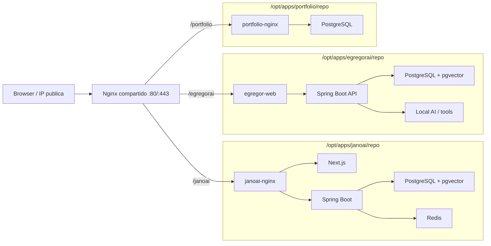

# Arquitectura VPS multiproyecto

## Objetivo

Una sola VPS economica para varios proyectos de prueba:

- JanoAI.
- EgregorAI.
- SG Dev Portfolio.
- Otros proyectos futuros.

La VM funciona como host Docker. Nginx es la unica entrada publica y cada app
queda aislada en su propio Compose.



## Reglas

- Solo Nginx publica puertos de internet.
- PostgreSQL, Redis y servicios internos no publican puertos.
- Cada proyecto tiene `.env` propio, no versionado.
- Los proyectos se conectan al proxy con la red externa `sgdev-proxy`.
- El proxy no conoce los secretos de las apps.
- Los backups se ejecutan por proyecto.
- Los repos se actualizan por `git pull` y `docker compose up -d --build`.

## Por que Nginx manual

Para tu caso conviene Nginx manual porque queres control desde Termius:

- ves los archivos reales;
- agregas o sacas rutas copiando plantillas;
- no dependes de labels magicas;
- podes entender exactamente que path va a que contenedor.

Caddy o Traefik tambien servirian, sobre todo con dominios y HTTPS automatico.
Pero para una VPS de pruebas con aprendizaje operativo, Nginx deja menos magia
oculta.

## Path ahora, subdominios despues

Con IP estatica y sin dominio, los paths son practicos:

```text
https://sgdev.com.ar/portfolio/
https://sgdev.com.ar/egregorai/
https://sgdev.com.ar/otro-proyecto/
```

El costo tecnico es que cada frontend debe soportar base path. Cuando compres
dominio, lo mas limpio sera:

```text
https://jano.midominio.com
https://egregor.midominio.com
https://portfolio.midominio.com
```
