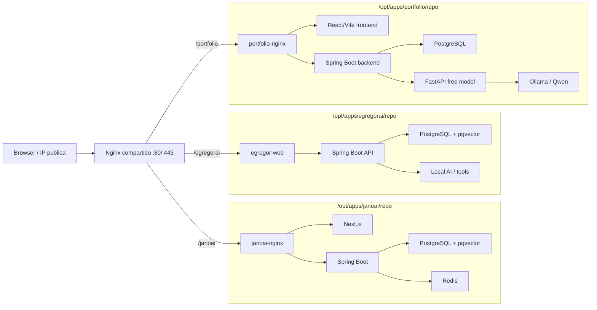

# Arquitectura VPS multiproyecto

## Objetivo

Una sola VPS economica para varios proyectos de prueba:

- JanoAI.
- EgregorAI.
- SG Dev Portfolio.
- Otros proyectos futuros.

La VM funciona como host Docker. Nginx es la unica entrada publica y cada app
queda aislada en su propio Compose.



## Reglas

- Solo Nginx publica puertos de internet.
- PostgreSQL, Redis y servicios internos no publican puertos.
- Cada proyecto tiene `.env` propio, no versionado.
- Los proyectos se conectan al proxy con la red externa `sgdev-proxy`.
- El proxy no conoce los secretos de las apps.
- Los backups se ejecutan por proyecto.
- Los datos de DB pueden archivarse por proyecto en `.xlsx` y reinsertarse con
  los scripts `app-db-export-excel.sh` / `app-db-import-excel.sh`.
- Los repos se actualizan por `git pull` y `docker compose up -d --build`.

## Admin y monitoreo

La consola web de `/admin` es una app estatica servida por el Nginx compartido.
Para leer datos reales de la VPS y ejecutar acciones usa servicios locales
separados, publicados solo a traves de Nginx:

```text
Browser /admin -> Nginx :80/:443 -> /admin/api/  -> host.docker.internal:9100
                                                    -> sgdev-admin-api.service
                                                    -> /proc, ps, df, docker

Browser /admin -> Nginx :80/:443 -> /admin-api/  -> host.docker.internal:9101
                                                    -> sgdev-admin-control-api.service
                                                    -> scripts/app-*.sh
```

`sgdev-admin-api.service` escucha en `127.0.0.1`, exige
`SGDEV_ADMIN_API_TOKEN` cuando esta configurado y solo expone endpoints
read-only. El API no ejecuta comandos recibidos desde el navegador; genera un
snapshot cerrado con CPU, memoria, discos, procesos, red, Docker y apps
registradas.

`sgdev-admin-control-api.service` escucha en `127.0.0.1:9101`, exige el mismo
token y ejecuta solo una lista cerrada de acciones: deploy, rebuild sin pull,
status, backup, stop, remove, alta guiada, export DB Excel y administracion de
tokens OpenAI del portfolio. En desarrollo local, `admin_api.py` puede correr
en modo SSH contra la VPS usando `.env.admin.local`; en la VPS corre en modo
`local` desde systemd.

Para tokens del portfolio, el control API usa
`SGDEV_PORTFOLIO_API_BASE_URL=https://sgdev.com.ar/portfolio/api` y llama al
backend por las rutas estables `/admin/usage/ips` y `/admin/usage/grant`.
El refactor interno del portfolio por dominios Java no cambia ese contrato HTTP.

## Por que Nginx manual

Para tu caso conviene Nginx manual porque queres control desde Termius:

- ves los archivos reales;
- agregas o sacas rutas copiando plantillas;
- no dependes de labels magicas;
- podes entender exactamente que path va a que contenedor.

Caddy o Traefik tambien servirian, sobre todo con dominios y HTTPS automatico.
Pero para una VPS de pruebas con aprendizaje operativo, Nginx deja menos magia
oculta.

## Path ahora, subdominios despues

Con IP estatica y sin dominio, los paths son practicos:

```text
https://sgdev.com.ar/portfolio/
https://sgdev.com.ar/egregorai/
https://sgdev.com.ar/otro-proyecto/
```

El costo tecnico es que cada frontend debe soportar base path. Cuando compres
dominio, lo mas limpio sera:

```text
https://jano.midominio.com
https://egregor.midominio.com
https://portfolio.midominio.com
```
