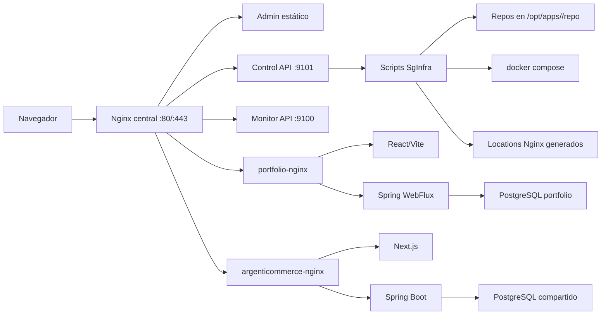

# Contexto actual de VPS, despliegues y proyectos del portfolio

Fecha del relevamiento: 2026-07-18 (America/Buenos_Aires).

## Alcance

Este documento consolida:

- el estado de los repos locales `SgInfra` y `sgdev-porfolio`;
- el estado real de la VPS `143.95.217.87`;
- lo que hoy puede y no puede hacer el admin de SgInfra;
- el flujo recomendado para crear y desplegar aplicaciones desde el admin;
- el diseño de una sección de proyectos separada de las demos del portfolio;
- el orden de implementación y los controles necesarios antes de automatizar más acciones.

El relevamiento remoto fue de solo lectura. No se desplegó, reinició, detuvo ni eliminó ningún servicio.

## Resumen ejecutivo

La base de infraestructura ya está bien encaminada. SgInfra registra aplicaciones por `slug`, clona repositorios, ejecuta Docker Compose, genera rutas Nginx y expone acciones desde un admin web. En la VPS hay dos apps registradas y funcionando: `portfolio` y `argenticommerce`.

El admin todavía no permite operar únicamente desde la interfaz de punta a punta. El alta actual supone que el repositorio ya incluye Dockerfiles y Compose válidos, y que alguien crea por fuera los secretos y archivos `.env`. Tampoco genera adaptadores Docker por tecnología, valida el Compose antes de guardar, verifica salud pública después del deploy ni ofrece rollback.

La sección de proyectos del portfolio no existe todavía. Las demos actuales son contenido TypeScript estático y las únicas rutas principales son Inicio, Demos y Contacto. El backend y la base del portfolio tampoco tienen tablas ni endpoints de catálogo de proyectos.

La recomendación es mantener dos conceptos separados pero vinculables:

1. **Aplicación desplegada:** recurso operativo de SgInfra, con repo, Compose, contenedores, ruta, logs y backups.
2. **Proyecto de portfolio:** contenido editorial publicado, con título, descripción, imágenes, tecnologías y enlace. Puede apuntar a una app de SgInfra, a una URL externa o quedar como borrador.

El mismo admin de SgInfra puede administrar ambos, pero el portfolio debe ser dueño de sus datos editoriales y sus imágenes.

## Estado comprobado

### Repositorios

| Recurso | Local | VPS | Estado |
| --- | --- | --- | --- |
| SgInfra | `ac1176e` | `ac1176e` | Sincronizado con `origin/main` |
| sgdev-porfolio | `8096d9c` | `8096d9c` | Sincronizado con `origin/main` |
| ArgentiCommerce | No forma parte de los dos repos locales relevados | `3668024` | Dos commits detrás de `origin/main` (`ae9c98a`) |

Los dos commits pendientes de ArgentiCommerce son:

- `828c86d Separate CI and manual VPS deploy`;
- `ae9c98a Remove MercadoLibre service integration`.

Actualizar ArgentiCommerce no es un simple redeploy visual: el cambio elimina controladores, cliente y variables de integración de MercadoLibre, además de retirar la red `sgdev-services` de su Compose. Debe validarse como cambio funcional.

### Host

- Ubuntu 22.04.5 LTS, kernel 6.8.
- Docker 29.6.1 y Docker Compose 5.2.0.
- 3.8 GiB de RAM; aproximadamente 1.5 GiB disponible al relevar.
- Sin swap.
- Disco raíz de 98 GiB, 31% utilizado.
- UFW inactivo.
- SSH escuchando en `22022`.
- Certificado Let's Encrypt de `sgdev.com.ar` y `www.sgdev.com.ar` válido hasta 2026-09-30.
- Hay 6.1 GiB de build cache reclamable, pero no se limpió durante esta auditoría.

### Servicios SgInfra

| Servicio | Estado | Bind |
| --- | --- | --- |
| `sgdev-admin-api` | Activo | `172.17.0.1:9100` |
| `sgdev-admin-control-api` | Activo | `172.17.0.1:9101` |
| `sgdev-webhook` | Inactivo | Esperaría `9000` |
| `sgdev-proxy-nginx` | Activo y saludable | Público en 80/443 |

Rutas públicas comprobadas:

- `https://sgdev.com.ar/portfolio/` responde 200;
- `https://sgdev.com.ar/portfolio/api/portfolio/health` responde 200;
- `https://sgdev.com.ar/argenticommerce/` responde 200;
- `https://sgdev.com.ar/admin-api/health` responde 200;
- `https://sgdev.com.ar/admin-api/state` responde 401 sin credenciales, como corresponde.

### Apps y contenedores

`portfolio` usa:

- PostgreSQL;
- Ollama y un contenedor one-shot que descarga el modelo;
- API de modelo libre;
- backend Spring Boot/WebFlux;
- frontend React/Vite;
- Nginx propio conectado a `sgdev-proxy`.

El contenedor one-shot `portfolio-ollama-pull` está detenido con código 0; es el estado esperado después de descargar el modelo.

`argenticommerce` usa:

- frontend Next.js;
- API Spring Boot;
- Nginx propio;
- un servicio auxiliar `db` que contiene las herramientas PostgreSQL y verifica la base compartida;
- PostgreSQL real en `sgdev-shared-postgres`;
- redes externas `sgdev-data` y, en la versión desplegada, `sgdev-services`.

Sus cuatro contenedores están activos y saludables.

### Registro actual de apps

Portfolio:

```text
APP_PATH=/portfolio
APP_UPSTREAM=http://portfolio-nginx:80
REPO_DIR=/opt/apps/portfolio/repo
COMPOSE_FILES="docker-compose.yml /opt/sgdev-infra/examples/project-compose/portfolio.compose.proxy.override.yml"
ENV_FILE=.env
BRANCH=main
STRIP_PREFIX=false
```

ArgentiCommerce:

```text
APP_PATH=/argenticommerce
APP_UPSTREAM=http://argenticommerce-nginx:80
REPO_DIR=/opt/apps/argenticommerce/repo
COMPOSE_FILES=compose.sgdev.yml
ENV_FILE=.env.sgdev
BRANCH=main
STRIP_PREFIX=false
```

Ambas aplicaciones reciben el prefijo completo porque sus gateways internos conocen `/portfolio` o `/argenticommerce`.

## Arquitectura actual



## Qué puede hacer hoy el admin

El alta guiada solicita:

- nombre, slug, app ID y dominio;
- URL Git, branch y directorio del repo;
- archivo o archivos Compose y archivo de entorno;
- ruta pública y upstream Docker;
- límites de Nginx;
- volúmenes de backup y algunos datos para exportación Excel.

`POST /admin-api/apps` ejecuta conceptualmente:

```text
app-new.sh
  -> crea /opt/apps/<slug>
  -> opcionalmente clona /opt/apps/<slug>/repo
  -> crea /etc/sgdev-infra/apps/<slug>.env
  -> genera proxy/nginx/app-locations/<slug>.conf
```

El botón Deploy ejecuta:

```text
app-deploy.sh <slug>
  -> lock por slug
  -> clone si el repo no existe
  -> fetch/checkout/pull --ff-only
  -> docker compose up -d --build
  -> restart del servicio nginx de la app, si existe
  -> regeneración de la ruta
  -> nginx -t y reload del proxy central
```

También hay acciones para estado, logs, rebuild sin pull, stop, quitar ruta, exportar datos y backup.

## Lo que falta para un flujo realmente “solo admin”

### Alta y archivos Docker

- No crea Dockerfiles, Compose ni configuración Nginx de una app nueva.
- No ofrece presets por tecnología.
- No permite cargar un ZIP ni crear un proyecto vacío.
- No maneja repos privados mediante deploy keys.
- No crea ni edita secretos o `.env` desde el admin.
- No inspecciona automáticamente los servicios y puertos del repo.
- No valida que el alias Docker coincida con `APP_UPSTREAM` antes de registrar.

### Seguridad y validación

- `repoDir` sólo se valida como ruta absoluta; debe quedar encerrado en `/opt/apps/<slug>`.
- `composeFiles` puede referir a cualquier ruta absoluta; debe limitarse a rutas permitidas o plantillas versionadas.
- `repoUrl` no tiene una allowlist de protocolos/hosts.
- `APP_PATH` no rechaza rutas reservadas como `/admin`, `/admin-api`, `/health` o `/__deploy`.
- El upstream podría apuntar a destinos internos no previstos.
- La API de control ejecuta builds Docker a partir de repos remotos. Un repositorio malicioso equivale a ejecución privilegiada en el host, por lo que la autenticación del admin es una frontera crítica.

### Deploy

- No hay preflight con `docker compose config --quiet`.
- No hay análisis de `ports`, `privileged`, `network_mode: host` o montajes sensibles.
- No hay deploy job asíncrono ni streaming de logs.
- No se espera salud con `docker compose up --wait`.
- No se hace smoke test público después del deploy.
- No se registra de forma durable commit, digest de imagen, resultado y duración.
- No hay rollback a la revisión anterior.
- No hay límites de CPU/RAM por app.

### Backups

Las dos apps registradas tienen incompleto el contrato de backup. En ArgentiCommerce, `BACKUP_VOLUMES` y `BACKUP_PATHS` están vacíos; el botón Backup no genera hoy un respaldo completo. La exportación Excel no reemplaza un `pg_dump` porque no conserva toda la semántica de la base.

Antes de actualizar ArgentiCommerce debe agregarse un backup PostgreSQL específico de la base compartida y probar su restauración.

### Inconsistencias operativas

- El proyecto Compose del portfolio se llama `repo`, no `portfolio`, porque el Compose usado no fija `name` y SgInfra no pasa `--project-name`.
- Cambiar el nombre del proyecto Compose del portfolio sin migración puede crear volúmenes nuevos y aparentar pérdida de datos. Debe hacerse con un plan explícito de volúmenes.
- El Compose base del portfolio publica `8795` en todas las interfaces. Esto contradice la regla de SgInfra de publicar sólo el proxy central.
- La base y el Nginx del portfolio están limitados a localhost mediante su `.env`, pero el free-model quedó en `0.0.0.0:8795` y ya recibe escaneos externos.
- OpenClaw está publicado en `0.0.0.0:47716` fuera del inventario de SgInfra.
- UFW está inactivo.
- Hay un `.env.bak-*` no versionado dentro del repo del portfolio. Tiene modo 600, pero debe salir del repo operativo después de confirmar que no es necesario.
- Existen directorios vacíos accidentales `/opt/sgdev-infra/;`, `/opt/sgdev-infra/git` y `/opt/sgdev-infra/diff`.
- `/opt/apps/mercadolibre` existe pero no tiene app registrada.
- Las respuestas HTTPS no incluyen todavía una política clara de HSTS/CSP y el admin no tiene rate limiting visible.

## Diseño recomendado para despliegues desde el admin

No conviene intentar generar un Dockerfile universal. El admin debería ofrecer contratos explícitos:

1. **Compose existente:** el repo ya trae su despliegue de producción. SgInfra sólo genera un override para la red y el alias del proxy.
2. **Vite/React estático:** genera Dockerfile multi-stage y Nginx.
3. **Next.js standalone:** genera Dockerfile Node multi-stage y gateway compatible con base path.
4. **Spring Boot:** genera Dockerfile Maven/Gradle multi-stage y servicio HTTP.
5. **Monorepo React/Next + Spring:** genera frontend, backend y gateway.
6. **WordPress:** conserva el flujo especializado existente.

Si el repo no coincide con un preset, el alta queda en estado `draft` y exige un Compose revisado, en vez de adivinar.

### Layout objetivo por app

```text
/opt/apps/<slug>/
  repo/                         # clone Git, sin archivos runtime inventados
  deploy/                       # adaptador generado por SgInfra
    compose.yml
    Dockerfile.frontend
    Dockerfile.backend
    nginx.conf
    manifest.json               # preset, versión y hashes de archivos
  releases/                     # metadatos de revisiones desplegadas

/etc/sgdev-infra/
  apps/<slug>.env               # configuración operativa no secreta
  secrets/<slug>.env            # secretos, modo 600
  credentials/<slug>/           # deploy key opcional, modo 700/600

/var/log/sgdev-infra/
  jobs/<job-id>.log
```

El adaptador puede usar `../repo` como contexto de build. Los `COPY` siguen limitados al repo, mientras Docker lee los Dockerfiles desde `deploy/`.

### Flujo objetivo del wizard

1. **Identidad:** nombre, slug, path y dominio.
2. **Fuente:** URL Git, branch, repo público o deploy key referenciada.
3. **Detección:** inspección de archivos, stack, puertos y comandos de build.
4. **Contrato:** seleccionar Compose existente o un preset soportado.
5. **Servicios:** elegir el único gateway público, puerto interno y alias estable.
6. **Secretos:** formulario separado; los valores nunca vuelven a mostrarse luego de guardarse.
7. **Persistencia:** declarar DB, volúmenes, paths y política de backup.
8. **Preflight:** mostrar Compose renderizado y errores antes de crear la ruta.
9. **Deploy:** job asíncrono con log en vivo.
10. **Verificación:** esperar healthchecks y hacer smoke test por dominio/path.
11. **Publicación opcional:** ofrecer crear un proyecto borrador en el portfolio.

### Estados y endpoints sugeridos

Estados:

```text
draft -> validating -> ready -> deploying -> healthy
                                      |-> failed -> rollback
```

API sugerida:

```text
POST   /v1/apps/inspect
POST   /v1/apps
PATCH  /v1/apps/{slug}
PUT    /v1/apps/{slug}/secrets
POST   /v1/apps/{slug}/generate
POST   /v1/apps/{slug}/validate
POST   /v1/apps/{slug}/deployments
GET    /v1/jobs/{jobId}
GET    /v1/jobs/{jobId}/events
POST   /v1/apps/{slug}/rollback
```

Validaciones mínimas del servidor:

- resolver y comprobar que todos los paths queden bajo roots permitidos;
- prohibir paths públicos reservados o duplicados;
- limitar Git a protocolos y hosts aprobados;
- rechazar `privileged`, Docker socket, host PID/IPC/network y mounts sensibles;
- rechazar `ports` públicos salvo excepciones aprobadas;
- exigir una conexión a `sgdev-proxy` y un alias que coincida con el upstream;
- fijar `--project-name <slug>` para apps nuevas;
- ejecutar `docker compose config --quiet` antes del build;
- guardar commit y digests antes y después;
- ejecutar `up -d --wait --wait-timeout ...`;
- validar Nginx antes del reload;
- sólo publicar la ruta después de pasar el smoke test, o restaurar la ruta anterior.

## Diseño de “Proyectos” en el portfolio

### Separación conceptual

Las demos son experiencias integradas dentro del propio portfolio: chat, turnos y documentos. Los proyectos son productos o sistemas completos desplegados, como ArgentiCommerce.

No deben compartir el mismo array `demoCards` ni el mismo modelo. Un proyecto puede estar:

- en borrador;
- publicado;
- destacado;
- archivado;
- vinculado a una app de SgInfra;
- publicado con una URL externa aunque no esté gestionado por SgInfra.

### Propiedad de datos

El backend del portfolio debe ser dueño del catálogo. SgInfra administra esos datos mediante endpoints protegidos, de la misma manera en que hoy actúa como puente para las cuotas de tokens.

Esto evita que el frontend público dependa del control API de infraestructura y mantiene el catálogo disponible aunque el admin esté en mantenimiento.

### Modelo de datos sugerido

`portfolio_projects`:

- `id` UUID;
- `slug` único;
- `title`;
- `summary` para la card;
- `description_md` para el detalle;
- `live_url`;
- `repository_url` opcional;
- `infra_app_slug` opcional;
- `tech_stack` JSONB;
- `status`: `draft`, `published`, `archived`;
- `featured`;
- `sort_order`;
- `created_at`, `updated_at`, `published_at`.

`portfolio_project_images`:

- `id` UUID;
- `project_id`;
- `kind`: `cover` o `gallery`;
- `storage_key`;
- `alt_text`;
- `sort_order`;
- `mime_type`, `size_bytes`, `width`, `height`;
- `created_at`.

La primera versión puede limitarse a una portada y dos imágenes de galería, aunque el modelo soporte más.

### Archivos de imagen

Para esta VPS alcanza un volumen Docker dedicado:

```text
portfolio_project_media:/app/data/project-media
```

Requisitos:

- aceptar sólo JPEG, PNG o WebP comprobando el contenido real;
- máximo sugerido de 5 MiB por imagen;
- renombrar a IDs generados, nunca usar el nombre enviado como path;
- generar miniaturas WebP para las cards;
- servir archivos con cache y tipos correctos;
- incluir el volumen en backup y restauración;
- dejar abierta una interfaz de storage para migrar a S3 en el futuro.

### API del portfolio

Pública:

```text
GET /api/projects
GET /api/projects/{slug}
GET /api/project-media/{key}
```

Administrativa:

```text
GET    /api/admin/projects
POST   /api/admin/projects
PUT    /api/admin/projects/{id}
DELETE /api/admin/projects/{id}
POST   /api/admin/projects/{id}/images
DELETE /api/admin/projects/{id}/images/{imageId}
POST   /api/admin/projects/{id}/publish
POST   /api/admin/projects/{id}/archive
```

Los endpoints administrativos deben usar un token de servicio exclusivo, distinto de la contraseña de la VPS y del login humano.

### Cambios en SgInfra admin

Agregar una ruta de navegación `Portfolio > Proyectos` con:

- lista de borradores, publicados y archivados;
- formulario de nombre, resumen, descripción, stack y enlaces;
- selección opcional de una app registrada para completar `live_url`;
- carga y orden de portada/galería;
- preview de card y detalle;
- publicar, despublicar y archivar;
- confirmación explícita para borrar;
- estado del último deploy de la app vinculada, sólo como información.

El control API de SgInfra funcionaría como backend-for-frontend y reenviaría estas operaciones al backend del portfolio. Para tráfico interno debe preferirse la red Docker o el gateway interno, no una vuelta por la URL pública.

### Cambios en el frontend del portfolio

Agregar:

- navegación `Proyectos` separada de `Demos`;
- ruta `/proyectos` con cards obtenidas de la API;
- ruta `/proyectos/:slug` con imágenes, descripción, stack y CTA al producto;
- bloque opcional de proyectos destacados en Inicio;
- estados de loading, vacío y error;
- metadatos SEO por proyecto.

El router actual usa una unión cerrada de rutas. Para `/proyectos/:slug` debe incorporarse resolución dinámica en vez de agregar cada slug a mano.

### Integración despliegue-publicación

Después de un deploy saludable, SgInfra puede mostrar:

```text
[ ] Crear o actualizar un borrador en el portfolio
```

No debe publicar automáticamente. Un deploy técnico y una publicación editorial son operaciones diferentes. La asociación recomendada es `portfolio_projects.infra_app_slug`.

## Orden de implementación recomendado

### Fase 0: estabilizar y asegurar la VPS

1. Crear y probar backups reales de Portfolio y ArgentiCommerce.
2. Restringir o retirar los puertos públicos `8795` y `47716` según necesidad.
3. Activar UFW permitiendo únicamente `22022`, `80` y `443`, más excepciones justificadas.
4. Agregar swap apropiado para un host de 4 GiB que compila Java/Node y ejecuta Ollama.
5. Separar credencial humana, token del admin, token de servicio del portfolio y acceso SSH.
6. Añadir rate limiting y headers de seguridad al admin.
7. Retirar el backup `.env` del repo operativo y revisar los directorios accidentales.
8. Rotar la contraseña root compartida durante esta auditoría y migrar SSH a clave con un usuario de operación.

### Fase 1: contrato de despliegue seguro

1. Incorporar validación estricta de paths, URLs, rutas y Compose.
2. Añadir manifest por app y project name estable.
3. Separar secretos en `/etc/sgdev-infra/secrets`.
4. Convertir deploys en jobs con logs y revisiones.
5. Añadir health wait, smoke test y rollback.
6. Crear primero el modo `Compose existente`, usando ArgentiCommerce como referencia.

### Fase 2: presets y generación de archivos

1. Vite/React.
2. Next.js standalone.
3. Spring Boot.
4. Monorepo frontend + backend + gateway.
5. Preview/diff de los archivos generados antes de guardarlos.

### Fase 3: CMS de proyectos

1. Migraciones y modelo en PostgreSQL del portfolio.
2. Endpoints públicos y administrativos.
3. Volumen y procesamiento de imágenes.
4. Proxy administrativo desde SgInfra.
5. Pantalla `Portfolio > Proyectos`.

### Fase 4: frontend público

1. `/proyectos`.
2. `/proyectos/:slug`.
3. Cards destacadas en Inicio.
4. Crear ArgentiCommerce como primer proyecto publicado.

### Fase 5: actualización controlada de ArgentiCommerce

1. Revisar y aceptar la eliminación de la integración MercadoLibre.
2. Generar `pg_dump` de la base `argenticommerce` y verificar el archivo.
3. Registrar commit desplegado actual.
4. Ejecutar tests/build de los dos commits pendientes.
5. Desplegar desde el admin como job observado.
6. Verificar health, inicio, login, registro, storefront y funciones de pago.
7. Mantener un procedimiento de rollback al commit `3668024`.

## Criterios de aceptación

El objetivo “subir un proyecto usando únicamente el admin” se considera cumplido cuando:

- se puede registrar o clonar un repo sin entrar por SSH;
- se puede elegir un contrato soportado y generar/revisar sus archivos Docker;
- se pueden cargar secretos sin que vuelvan a exponerse;
- el preflight rechaza configuraciones peligrosas o incompletas;
- el deploy muestra progreso, espera salud y ejecuta smoke test;
- se puede volver a la revisión anterior;
- existe backup probado de los datos persistentes;
- la app sólo publica tráfico por el Nginx central;
- desde el mismo admin se puede crear un proyecto editorial, cargar imágenes y publicarlo;
- el portfolio muestra Demos y Proyectos como secciones distintas.

## Decisión recomendada

Usar SgInfra como plano de control único, pero no mezclar sus datos operativos con el contenido editorial:

- SgInfra conserva registro, build, deploy, red, proxy, logs, salud y backup.
- El portfolio conserva proyectos, imágenes, orden y estado de publicación.
- El admin de SgInfra presenta ambas capacidades en una sola interfaz.
- La relación entre ambas es opcional mediante `infra_app_slug`.

Ese diseño permite publicar ArgentiCommerce y futuros sistemas en la VPS sin convertir cada app desplegada automáticamente en contenido público ni acoplar el portfolio a archivos internos de infraestructura.
